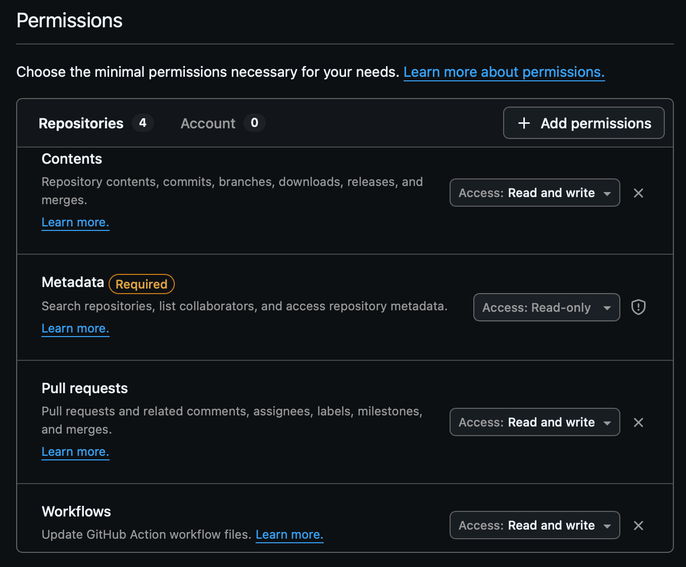
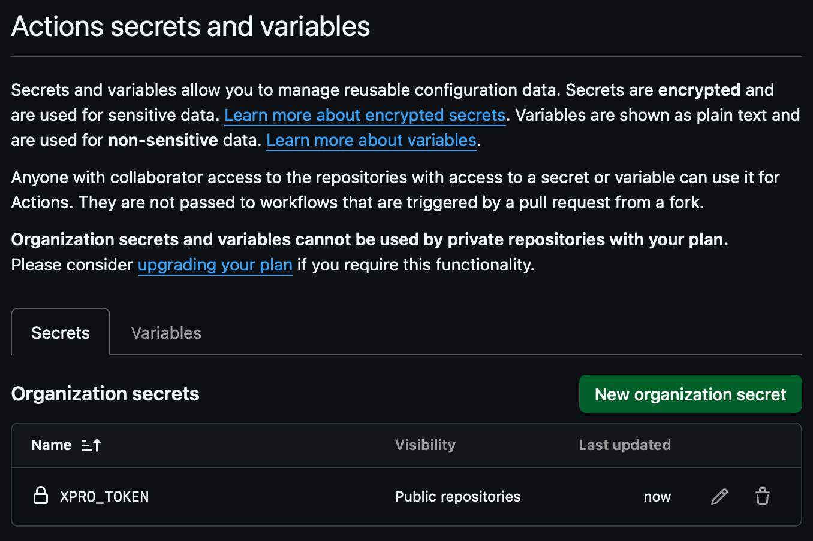

# Secrets and tokens

This document covers creation and configuration of `XPRO_TOKEN`, which is mapped by the caller workflow templates to the reusable workflows’ `automation_token` secret.

## When do I need `XPRO_TOKEN`?

The caller workflow templates (`xpinit`, `xpupdate`, and `xptag`) are written to provide `automation_token` from `secrets.XPRO_TOKEN`.

In general, you should provide `XPRO_TOKEN` if the automation needs to:

- push commits that modify `.github/workflows/*` in the caller repository
- create/edit/close pull requests and apply labels via the GitHub CLI (`gh`)
- push tags in ways that may need to trigger downstream workflows

### Required vs optional (quick matrix)

| Workflow | Uses `automation_token` | When `XPRO_TOKEN` is required |
| --- | --- | --- |
| `xpinit` | Yes (always) | Always required (creates/updates `.github/workflows/*`, pushes commits, opens PRs) |
| `xpupdate` | Yes | Required when the update includes changes under `.github/workflows/*` or when pushing commits to `externpro/externpro` is enabled; otherwise the workflow may fall back to `github.token` |
| `xptag` | Yes | Recommended if you rely on tags to trigger downstream workflows; `github.token` tag pushes may not trigger other workflows |

## Creating a fine-grained PAT

Create a fine-grained personal access token (PAT). Repository-scoped access is recommended (least privilege), but org-wide access can be appropriate when using a shared org secret across many repositories.

1. Go to GitHub settings:

   - `Settings` -> `Developer settings` -> `Personal access tokens` -> `Fine-grained tokens`

   

2. Click **Generate new token**.

3. Select:

   - **Resource owner**: your user or org
   - **Repository access**: only select the target repository (recommended; least privilege)
     - If you manage many repositories and want a single org-level token/secret that works everywhere, you can choose **All repositories**. This is more convenient but increases the blast radius if the token is compromised.

4. Set **Repository permissions**:

   - **Contents**: Read and write
   - **Pull requests**: Read and write
   - **Workflows**: Read and write

   

5. Click **Generate token**.

   

6. Copy the token value and store it securely.

   

## Adding `XPRO_TOKEN` to the repository

Add the PAT as a repository secret in the caller repository.

1. Go to the repository settings:

   - `Settings` -> `Secrets and variables` -> `Actions`

   

2. Click **New repository secret**.

   

3. Create the secret:

   - **Name**: `XPRO_TOKEN`
   - **Secret**: paste the PAT value

4. Save and confirm it shows up in the list.

   

## Adding `XPRO_TOKEN` to the organization

If you manage many repositories, you can add `XPRO_TOKEN` once at the organization level and share it to selected repositories.

1. Go to the organization settings:

   - `Organization` -> `Settings` -> `Secrets and variables` -> `Actions`

   

2. Click **New organization secret**.

   

3. Create the secret:

   - **Name**: `XPRO_TOKEN`
   - **Secret**: paste the PAT value
   - **Repository access**: choose which repositories should receive the secret

4. Save and confirm it shows up in the list.

   

## Troubleshooting

- If you see errors mentioning `automation_token` or inability to push updates under `.github/workflows/*`, confirm the PAT has **Workflows: Read and write**.
- If git pushes or file updates fail, confirm the PAT has repository access and **Contents: Read and write**.
- If PR operations fail (create/edit/close PRs, add labels), confirm the PAT has **Pull requests: Read and write**.
  - If **Pull requests** permissions are not available when creating a fine-grained PAT, verify the **resource owner** and check organization policies/restrictions for fine-grained PAT permissions.
